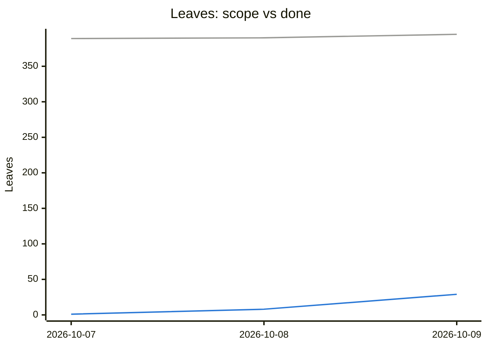

<!-- GENERATED by `cargo xtask progress` from ROADMAP.md. Do not edit by hand. -->
# Persia DB — Progress

**29/395 leaves done (7%)** · 1 in progress · `██░░░░░░░░░░░░░░░░░░░░░░░░░░░░` · last snapshot: 2026-10-09

Status lives in [`ROADMAP.md`](./ROADMAP.md) checkboxes (`[ ]` todo · `[~]` in progress · `[x]` done).
After changing one, run `cargo xtask progress --record`.

## Milestone graph

Arrows point from a dependency to the milestone that needs it (implied edges omitted).
✅ done · 🔨 in progress · ▶️ ready (deps done) · ⏳ blocked

```mermaid
flowchart LR
  M0["✅ done<br/><b>M0</b> Project bootstrap<br/>26/26 · 100%"]:::done
  M1["🔨 in progress<br/><b>M1</b> Format primitives<br/>3/47 · 6%"]:::doing
  M2["⏳ blocked<br/><b>M2</b> Storage abstraction & local backends<br/>0/23 · 0%"]:::blocked
  M3["⏳ blocked<br/><b>M3</b> Schema, documents, collections<br/>0/14 · 0%"]:::blocked
  M4["▶️ ready<br/><b>M4</b> Text analysis<br/>0/22 · 0%"]:::ready
  M5["⏳ blocked<br/><b>M5</b> Segment writer & reader<br/>0/34 · 0%"]:::blocked
  M6["⏳ blocked<br/><b>M6</b> Write path, durability, merging<br/>0/29 · 0%"]:::blocked
  M7["⏳ blocked<br/><b>M7</b> Query engine & ranking<br/>0/29 · 0%"]:::blocked
  M8["⏳ blocked<br/><b>M8</b> Zero-results avoidance<br/>0/23 · 0%"]:::blocked
  M9["⏳ blocked<br/><b>M9</b> Blob store<br/>0/19 · 0%"]:::blocked
  M10["⏳ blocked<br/><b>M10</b> Embedded API<br/>0/17 · 0%"]:::blocked
  M11["⏳ blocked<br/><b>M11</b> Server<br/>0/22 · 0%"]:::blocked
  M12["⏳ blocked<br/><b>M12</b> Cloud storage backends<br/>0/28 · 0%"]:::blocked
  M13["⏳ blocked<br/><b>M13</b> Distribution & Kubernetes<br/>0/24 · 0%"]:::blocked
  M14["⏳ blocked<br/><b>M14</b> SDKs<br/>0/17 · 0%"]:::blocked
  M15["⏳ blocked<br/><b>M15</b> Benchmarks, hardening, v1.0<br/>0/21 · 0%"]:::blocked
  M0 --> M1
  M1 --> M2
  M1 --> M3
  M0 --> M4
  M3 --> M5
  M4 --> M5
  M2 --> M6
  M5 --> M6
  M5 --> M7
  M7 --> M8
  M2 --> M9
  M6 --> M10
  M8 --> M10
  M9 --> M10
  M10 --> M11
  M11 --> M12
  M12 --> M13
  M13 --> M14
  M14 --> M15
  classDef done fill:#0ca30c,stroke:#0b0b0b,color:#0b0b0b
  classDef doing fill:#fab219,stroke:#0b0b0b,color:#0b0b0b
  classDef ready fill:#fcfcfb,stroke:#0b0b0b,stroke-width:2px,color:#0b0b0b
  classDef blocked fill:#e8e8e6,stroke:#9a9a96,stroke-dasharray:4 3,color:#52514e
```

## Milestones

| Milestone | State | Progress | Done | Doing | Leaves | Deps |
|---|---|---|--:|--:|--:|---|
| **M0** Project bootstrap | ✅ done | `████████████████████` 100% | 26 | 0 | 26 | — |
| **M1** Format primitives | 🔨 in progress | `█░░░░░░░░░░░░░░░░░░░` 6% | 3 | 1 | 47 | M0 |
| **M2** Storage abstraction & local backends | ⏳ blocked | `░░░░░░░░░░░░░░░░░░░░` 0% | 0 | 0 | 23 | M1 |
| **M3** Schema, documents, collections | ⏳ blocked | `░░░░░░░░░░░░░░░░░░░░` 0% | 0 | 0 | 14 | M1 |
| **M4** Text analysis | ▶️ ready | `░░░░░░░░░░░░░░░░░░░░` 0% | 0 | 0 | 22 | M0 |
| **M5** Segment writer & reader | ⏳ blocked | `░░░░░░░░░░░░░░░░░░░░` 0% | 0 | 0 | 34 | M1, M3, M4 |
| **M6** Write path, durability, merging | ⏳ blocked | `░░░░░░░░░░░░░░░░░░░░` 0% | 0 | 0 | 29 | M2, M5 |
| **M7** Query engine & ranking | ⏳ blocked | `░░░░░░░░░░░░░░░░░░░░` 0% | 0 | 0 | 29 | M5 |
| **M8** Zero-results avoidance | ⏳ blocked | `░░░░░░░░░░░░░░░░░░░░` 0% | 0 | 0 | 23 | M7 |
| **M9** Blob store | ⏳ blocked | `░░░░░░░░░░░░░░░░░░░░` 0% | 0 | 0 | 19 | M1, M2 |
| **M10** Embedded API | ⏳ blocked | `░░░░░░░░░░░░░░░░░░░░` 0% | 0 | 0 | 17 | M6, M7, M8, M9 |
| **M11** Server | ⏳ blocked | `░░░░░░░░░░░░░░░░░░░░` 0% | 0 | 0 | 22 | M10 |
| **M12** Cloud storage backends | ⏳ blocked | `░░░░░░░░░░░░░░░░░░░░` 0% | 0 | 0 | 28 | M2, M6, M9, M11 |
| **M13** Distribution & Kubernetes | ⏳ blocked | `░░░░░░░░░░░░░░░░░░░░` 0% | 0 | 0 | 24 | M11, M12 |
| **M14** SDKs | ⏳ blocked | `░░░░░░░░░░░░░░░░░░░░` 0% | 0 | 0 | 17 | M11, M13 |
| **M15** Benchmarks, hardening, v1.0 | ⏳ blocked | `░░░░░░░░░░░░░░░░░░░░` 0% | 0 | 0 | 21 | M1, M2, M3, M4, M5, M6, M7, M8, M9, M10, M11, M12, M13, M14 |

## In progress

- `1.1.2.1` Encode/decode with overlong-encoding rejection (M1)

## Ready next (first 15 todo leaves whose milestone deps are done)

- `1.1.2.2` [T] property round-trip; golden vectors; fuzz decode (M1)
- `1.1.3` Zigzag encoding for signed integers (M1)
- `1.1.4` Checked arithmetic helpers for offsets/lengths (`Offset`, `Len` newtypes) (M1)
- `1.1.5` `#![deny(clippy::arithmetic_side_effects)]` in `persia-format` (and later in engine segment readers); fix all hits with checked ops (M1)
- `1.2.1.1` Delta encode/decode with strictly-increasing validation (M1)
- `1.2.1.2` [T] property round-trip for random sorted sets incl. empty, single, max values (M1)
- `1.2.2.1` Scalar pack/unpack for all widths (M1)
- `1.2.2.2` Compute minimal bit-width for a block (M1)
- `1.2.2.3` Packed-size formula + bounds checks on decode input (M1)
- `1.2.2.4` [T] exhaustive width test; property round-trip; fuzz (M1)
- `1.2.2.5` Benchmark scalar throughput (baseline for SIMD later) (M1)
- `1.2.3.1` Encode block with `last_docid`, `max_tf`, width metadata header (M1)
- `1.2.3.2` Decode block into caller-provided buffer (no allocation in hot path) (M1)
- `1.2.3.3` `advance_to(target)` within a block (galloping/binary search) (M1)
- `1.2.4` Frame-of-reference codec for numeric columns (i64/f64 via order-preserving bits) (M1)
- … and 50 more

## Burn-up

Gray line: total leaves (scope). Blue line: leaves done.

| Date | Done | In progress | Total | Done % |
|---|--:|--:|--:|--:|
| 2026-10-07 | 1 | 2 | 389 | 0% |
| 2026-10-08 | 8 | 2 | 390 | 2% |
| 2026-10-09 | 29 | 1 | 395 | 7% |
