<!-- GENERATED by scripts/progress.py from ROADMAP.md. Do not edit by hand. -->
# Persia DB — Progress

**1/389 leaves done (0%)** · 2 in progress · `░░░░░░░░░░░░░░░░░░░░░░░░░░░░░░` · last snapshot: 2026-10-07

Status lives in [`ROADMAP.md`](./ROADMAP.md) checkboxes (`[ ]` todo · `[~]` in progress · `[x]` done).
After changing one, run `python3 scripts/progress.py --record`.

## Milestone graph

Arrows point from a dependency to the milestone that needs it (implied edges omitted).
✅ done · 🔨 in progress · ▶️ ready (deps done) · ⏳ blocked

```mermaid
flowchart LR
  M0["🔨 in progress<br/><b>M0</b> Project bootstrap<br/>1/27 · 4%"]:::doing
  M1["⏳ blocked<br/><b>M1</b> Format primitives<br/>0/43 · 0%"]:::blocked
  M2["⏳ blocked<br/><b>M2</b> Storage abstraction & local backends<br/>0/22 · 0%"]:::blocked
  M3["⏳ blocked<br/><b>M3</b> Schema, documents, collections<br/>0/14 · 0%"]:::blocked
  M4["⏳ blocked<br/><b>M4</b> Text analysis<br/>0/22 · 0%"]:::blocked
  M5["⏳ blocked<br/><b>M5</b> Segment writer & reader<br/>0/34 · 0%"]:::blocked
  M6["⏳ blocked<br/><b>M6</b> Write path, durability, merging<br/>0/29 · 0%"]:::blocked
  M7["⏳ blocked<br/><b>M7</b> Query engine & ranking<br/>0/29 · 0%"]:::blocked
  M8["⏳ blocked<br/><b>M8</b> Zero-results avoidance<br/>0/23 · 0%"]:::blocked
  M9["⏳ blocked<br/><b>M9</b> Blob store<br/>0/18 · 0%"]:::blocked
  M10["⏳ blocked<br/><b>M10</b> Embedded API<br/>0/17 · 0%"]:::blocked
  M11["⏳ blocked<br/><b>M11</b> Server<br/>0/21 · 0%"]:::blocked
  M12["⏳ blocked<br/><b>M12</b> Cloud storage backends<br/>0/28 · 0%"]:::blocked
  M13["⏳ blocked<br/><b>M13</b> Distribution & Kubernetes<br/>0/24 · 0%"]:::blocked
  M14["⏳ blocked<br/><b>M14</b> SDKs<br/>0/17 · 0%"]:::blocked
  M15["⏳ blocked<br/><b>M15</b> Benchmarks, hardening, v1.0<br/>0/21 · 0%"]:::blocked
  M0 --> M1
  M1 --> M2
  M1 --> M3
  M0 --> M4
  M3 --> M5
  M4 --> M5
  M2 --> M6
  M5 --> M6
  M5 --> M7
  M7 --> M8
  M2 --> M9
  M6 --> M10
  M8 --> M10
  M9 --> M10
  M10 --> M11
  M11 --> M12
  M12 --> M13
  M13 --> M14
  M14 --> M15
  classDef done fill:#0ca30c,stroke:#0b0b0b,color:#0b0b0b
  classDef doing fill:#fab219,stroke:#0b0b0b,color:#0b0b0b
  classDef ready fill:#fcfcfb,stroke:#0b0b0b,stroke-width:2px,color:#0b0b0b
  classDef blocked fill:#e8e8e6,stroke:#9a9a96,stroke-dasharray:4 3,color:#52514e
```

## Milestones

| Milestone | State | Progress | Done | Doing | Leaves | Deps |
|---|---|---|--:|--:|--:|---|
| **M0** Project bootstrap | 🔨 in progress | `█▒░░░░░░░░░░░░░░░░░░` 4% | 1 | 2 | 27 | — |
| **M1** Format primitives | ⏳ blocked | `░░░░░░░░░░░░░░░░░░░░` 0% | 0 | 0 | 43 | M0 |
| **M2** Storage abstraction & local backends | ⏳ blocked | `░░░░░░░░░░░░░░░░░░░░` 0% | 0 | 0 | 22 | M1 |
| **M3** Schema, documents, collections | ⏳ blocked | `░░░░░░░░░░░░░░░░░░░░` 0% | 0 | 0 | 14 | M1 |
| **M4** Text analysis | ⏳ blocked | `░░░░░░░░░░░░░░░░░░░░` 0% | 0 | 0 | 22 | M0 |
| **M5** Segment writer & reader | ⏳ blocked | `░░░░░░░░░░░░░░░░░░░░` 0% | 0 | 0 | 34 | M1, M3, M4 |
| **M6** Write path, durability, merging | ⏳ blocked | `░░░░░░░░░░░░░░░░░░░░` 0% | 0 | 0 | 29 | M2, M5 |
| **M7** Query engine & ranking | ⏳ blocked | `░░░░░░░░░░░░░░░░░░░░` 0% | 0 | 0 | 29 | M5 |
| **M8** Zero-results avoidance | ⏳ blocked | `░░░░░░░░░░░░░░░░░░░░` 0% | 0 | 0 | 23 | M7 |
| **M9** Blob store | ⏳ blocked | `░░░░░░░░░░░░░░░░░░░░` 0% | 0 | 0 | 18 | M1, M2 |
| **M10** Embedded API | ⏳ blocked | `░░░░░░░░░░░░░░░░░░░░` 0% | 0 | 0 | 17 | M6, M7, M8, M9 |
| **M11** Server | ⏳ blocked | `░░░░░░░░░░░░░░░░░░░░` 0% | 0 | 0 | 21 | M10 |
| **M12** Cloud storage backends | ⏳ blocked | `░░░░░░░░░░░░░░░░░░░░` 0% | 0 | 0 | 28 | M2, M6, M9, M11 |
| **M13** Distribution & Kubernetes | ⏳ blocked | `░░░░░░░░░░░░░░░░░░░░` 0% | 0 | 0 | 24 | M11, M12 |
| **M14** SDKs | ⏳ blocked | `░░░░░░░░░░░░░░░░░░░░` 0% | 0 | 0 | 17 | M11, M13 |
| **M15** Benchmarks, hardening, v1.0 | ⏳ blocked | `░░░░░░░░░░░░░░░░░░░░` 0% | 0 | 0 | 21 | M1, M2, M3, M4, M5, M6, M7, M8, M9, M10, M11, M12, M13, M14 |

## In progress

- `0.3.3` Install Claude Code assets: `CLAUDE.md`, `.claude/agents/*`, `.claude/skills/*` committed and documented (M0)
- `0.4.1` `docs/adr/0000-template.md` + ADR process (M0)

## Ready next (first 15 todo leaves whose milestone deps are done)

- `0.1.1.1` Workspace `Cargo.toml` with shared `[workspace.package]`, `[workspace.dependencies]`, lints table (M0)
- `0.1.1.2` Per-crate `Cargo.toml` + `lib.rs`/`main.rs` stubs with `#![forbid(unsafe_code)]` (except format) (M0)
- `0.1.1.3` Enforce dependency direction with a `cargo-deny`/script check (no upward deps) (M0)
- `0.1.2.1` `rust-toolchain.toml` (pinned stable) + MSRV policy (M0)
- `0.1.2.2` `rustfmt.toml`, `clippy.toml`, workspace lint levels (M0)
- `0.1.2.3` `.editorconfig`, `.gitignore`, `.gitattributes` (binary fixtures) (M0)
- `0.1.3.1` `LICENSE` (decide: Apache-2.0 vs MIT/Apache dual) + `NOTICE` (M0)
- `0.1.3.2` `README.md` stub (what it is, status, quickstart placeholder) (M0)
- `0.1.3.3` `CONTRIBUTING.md`, `CODE_OF_CONDUCT.md`, `SECURITY.md` (M0)
- `0.1.3.4` `CHANGELOG.md` (Keep a Changelog format) (M0)
- `0.2.1` PR workflow: fmt, clippy `-D warnings`, `cargo test --workspace`, on Linux + macOS (M0)
- `0.2.2` Supply chain: `cargo deny` (licenses, advisories, bans incl. tantivy/rocksdb/sled), `cargo audit` scheduled (M0)
- `0.2.3.1` Nightly extended property tests (`--features slow`) (M0)
- `0.2.3.2` Nightly fuzz run (time-boxed per target, corpus cached as artifact) (M0)
- `0.2.3.3` Weekly benchmark run storing results (regression tracking) (M0)
- … and 9 more

## Burn-up

_The chart appears once there are two snapshots (one per day with `--record`)._

| Date | Done | In progress | Total | Done % |
|---|--:|--:|--:|--:|
| 2026-10-07 | 1 | 2 | 389 | 0% |
