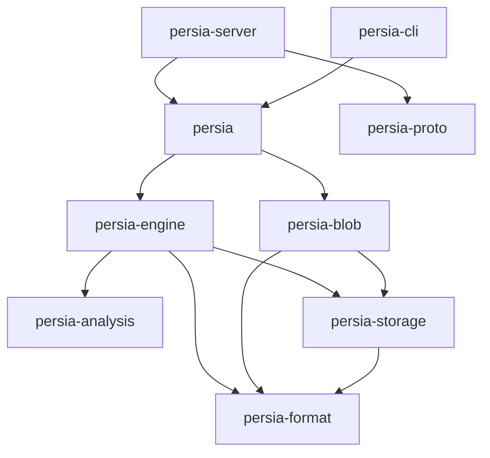

# Architecture

A map of the code for new contributors. The normative design is [`SPEC.md`](../SPEC.md); when this page and the
SPEC disagree, the SPEC wins and this page is a bug.

## Layers (SPEC §3)

```
 ┌───────────────── persia (embedded facade) ─────────────────┐
 │  Db ── Collection ── put/get/delete/search/blob             │
 ├──────────────┬──────────────┬───────────────┬──────────────┤
 │ persia-engine│ persia-blob  │persia-analysis│              │
 │ memtable/WAL │ chunks/dedup │ analyzers     │              │
 │ segments     │              │               │              │
 │ query+rank   │              │               │              │
 ├──────────────┴──────────────┴───────────────┴──────────────┤
 │ persia-storage:  Storage trait                              │
 │   memory │ local file container │ s3 │ gcs │ azure          │
 ├─────────────────────────────────────────────────────────────┤
 │ persia-format: encodings, frames, superblock, checksums     │
 └─────────────────────────────────────────────────────────────┘
      ▲ same engine embedded in:  persia-server (gRPC/HTTP) ◀── SDKs (Rust, Go)
```

## Crate dependency graph

Arrows point from a crate to what it depends on. This is enforced by `scripts/check_deps.py` (its `ALLOWED`
table is the source of truth); `persia-testutil` is a dev-dependency only and is omitted.



| Crate | Owns | SPEC | Sync/async |
|---|---|---|---|
| `persia-format` | Byte-level encodings, frames, header/superblock, block codecs, `BlobRef`/`BlobId`. No I/O policy. Holds the `unsafe` mmap module; other `unsafe` needs an ADR (CLAUDE.md) | §4, §5 | sync |
| `persia-storage` | `Storage` trait; memory, local container and cloud backends; `FaultyStorage` for crash tests | §4, §10 | async only in cloud backends |
| `persia-analysis` | Tokenizers, normalizers, stemmers, analyzer registry | §6.3 | sync |
| `persia-engine` | Memtable, WAL, segments, commit, merge, query, BM25F, relaxation | §5–§8 | **sync**, I/O only via `Storage` |
| `persia-blob` | Content-addressed chunked blobs, dedup, GC | §9 | sync core |
| `persia` | Public embedded API (`Db`, `Collection`); orders blob writes before document commits | §8, §9.5 | sync (an optional `tokio` wrapper is ROADMAP 10.1.6) |
| `persia-proto` | `persia.proto` and generated code | §12 | n/a |
| `persia-server` | gRPC + HTTP server, roles (writer/reader/router) | §11, §12 | async |
| `persia-cli` | `persia` binary: inspect, dump, verify, compact, bench | — | sync |

## Life of a write (SPEC §8.2)

1. `put(doc)` is appended to the **WAL** and applied to the **memtable**, so it is searchable at once.
2. When the memtable is big or idle enough, it is **flushed** into an immutable **segment**.
3. A **commit** publishes a new **manifest** listing the live segments. Locally that is: data frames, `fdatasync`,
   manifest frame, `fdatasync`, the inactive superblock slot, `fdatasync` (SPEC §4.5). Remotely it is
   `put_if_absent(manifests/<seq+1>)` (SPEC §10.4).
4. Background **merges** combine segments; deletions live in tombstone sidecars, never inside segments (SPEC §8.3).

## Life of a query (SPEC §7)

1. Query text is analyzed per field and compiled to a query AST.
2. Each segment (and the memtable) is searched in parallel with block-max WAND over BM25F scores; filters are
   bitmaps; tombstones are applied last.
3. Per-segment top-k results are merged.
4. If there are fewer hits than `min_results`, the **relaxation cascade** runs (synonyms → drop terms → prefix
   → fuzzy → fallback). The response says which level matched and what changed (SPEC §7.6).

## Glossary

Domain terms (Database, Collection, Segment, Memtable, WAL, Manifest, Commit, Frame, Blob, Shard,
Relaxation) are defined in [SPEC §2](../SPEC.md#2-terminology); use those names in code and docs, without
synonyms. Project terms:

| Term | Meaning |
|---|---|
| **Leaf** | A ROADMAP item with no children; one leaf = one issue = one PR |
| **Milestone** | `M0`…`M15` in ROADMAP; [`PROGRESS.md`](../PROGRESS.md) shows their state |
| **ADR** | Architecture decision record in [`docs/adr/`](./adr/) |
| **Golden file** | A checked-in fixture pinning exact on-disk bytes; must open forever (SPEC §15) |
| **Reference model** | The naive in-memory engine that the real engine is tested against (`persia-engine/tests/reference`) |
| **Relaxation level** | One step of the zero-results cascade, `L0`…`L5` (SPEC §7.6) |
